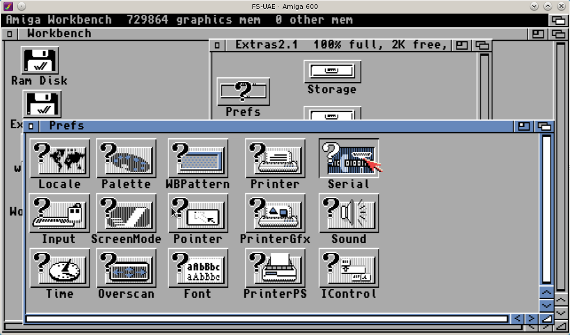
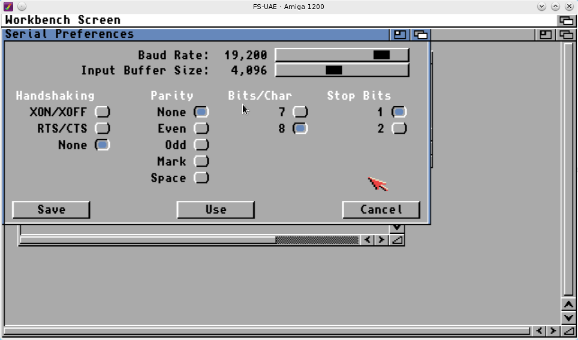
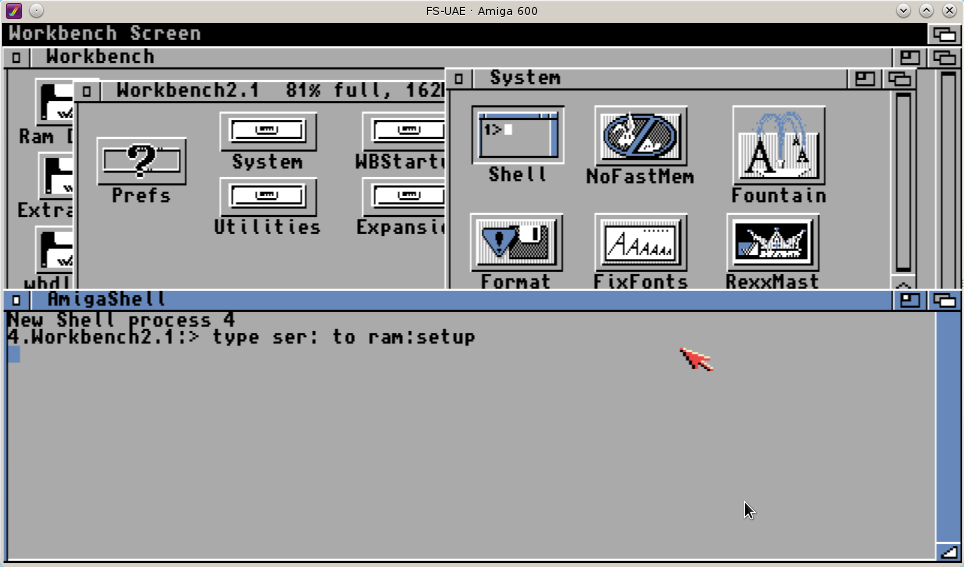
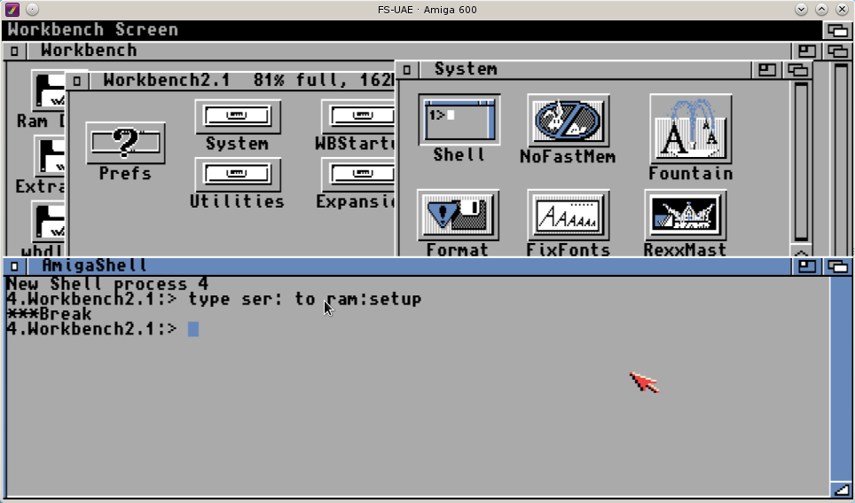

# Installation 

### Amiga serial port setup
First of all, if you don't have a mass memory storage like an hd or ssd with Workbench installed you will need the Workbench disk, in particular the Workbench boot disk and the extras disk.
Boot workbench wit the boot disk and when it's fully loaded insert the extras disk.
Navigate to Extras 2.1 -> Prefs and open the "Serial" application. 



Now set the Serial port with the following values:

* Baud rate: 19200
* Input buffer size: 4096
* Handshaking: None
* Parity: None
* Bits/Char: 8
* Stop Bits: 1



Now click 'Use' or 'Save', in the latter case the settings will be written into the Workbench disk so you don't have to repeat this process again after each reboot.

### Install alsfsNodejsServer on Debian 8 Jessie

Now it's time to do some work on the GNU/Linux PC, in this example I am going to use a Debian 8 distro, first of all make sure a recent version of nodejs is installed and install some dependencies in order to compile the alsfs server dependencies:

```
sudo apt-get update && apt-get install -y make g++ gcc curl wget gnupg
gcc -v
...
gcc version 6.3.0 20170516 (Debian 6.3.0-18) 
curl -sL https://deb.nodesource.com/setup_8.x | sudo -E bash -
sudo apt-get install -y nodejs
node -v
v8.9.0
```

Now go to [My github repository](https://github.com/Ozzyboshi/alsfsNodejsServer/releases) and grab the latest version of alsfsNodejsServer and install all the depenencies with npm:

```
wget https://api.github.com/repos/Ozzyboshi/alsfsNodejsServer/tarball -O alsfsNodejsServer.tar.gz
tar -xvzpf alsfsNodejsServer.tar.gz
cd Ozzyboshi-alsfsNodejsServer-e64ad45/
npm install
```

Now you can now start the bootstrap process with node amigajsserver.js #serialport# #iptobind# -bootstrap, for example in this case I tell amigajsserver to use the /dev/ttyUSB0 file attached to a [Manhattan da USB to Serial converter](http://www.manhattan-products.com/usb-to-serial-converter) and to bind the 8081 port to all ips  :
```
node amigajsserver.js /dev/ttyUSB0 0.0.0.0 -bootstrap
```
Of course if you have a real serial interface in your PC you should have something like /dev/sttyX.
If everything went well you should read this message:
```
Send stty 19200 -parenb cs8 crtscts -ixon -ixoff raw iutf8 -F /dev/ttyUSB0
Type 'type ser: to ram: setup on your amiga' and press a
```
If this is the case continue to [Copy alsfssrv to the amiga](#copy-alsfssrv-to-the-amiga)

### Install alsfsNodejsServer on a Raspberry Pi running Raspbian
Assuming you have already installed nodejs and npm like the installationb processo for Debian, follow these steps:

Go to [My github repository](https://github.com/Ozzyboshi/alsfsNodejsServer/releases) and grab the latest version of alsfsNodejsServer and install first node serialport with this command:
```
npm install serialport@^4.0.7 --unsafe-perm --build-from-source
```

then all the depenencies with npm, for example:

```
wget https://api.github.com/repos/Ozzyboshi/alsfsNodejsServer/tarball -O alsfsNodejsServer.tar.gz
tar -xvzpf alsfsNodejsServer.tar.gz
cd Ozzyboshi-alsfsNodejsServer-e64ad45/
npm install serialport@^4.0.7 --unsafe-perm --build-from-source
npm install
```

Now you can now start the bootstrap process with node amigajsserver.js #serialport# #iptobind# -bootstrap, for example in this case I tell amigajsserver to use the /dev/ttyUSB0 file attached to a [Manhattan da USB to Serial converter](http://www.manhattan-products.com/usb-to-serial-converter) and to bind the 8081 port to all ips  :
```
node amigajsserver.js /dev/ttyUSB0 0.0.0.0 -bootstrap
```
Of course if you have a real serial interface in your PC you should have something like /dev/sttyX.
If everything went well you should read this message:
```
Send stty 19200 -parenb cs8 crtscts -ixon -ixoff raw iutf8 -F /dev/ttyUSB0
Type 'type ser: to ram: setup on your amiga' and press a
```
If this is the case continue to [Copy alsfssrv to the amiga](#copy-alsfssrv-to-the-amiga)

### Install alsfsNodejsServer using Docker
If you have docker installed on your system, starting alsfsNodejsServer is trivial.
First of all download the application, decompress it and get the dependencies.
```
wget https://api.github.com/repos/Ozzyboshi/alsfsNodejsServer/tarball -O alsfsNodejsServer.tar.gz
tar -xvzpf alsfsNodejsServer.tar.gz
cd Ozzyboshi-alsfsNodejsServer-e64ad45/
docker run --rm -it -v `pwd`:/server -w /server node /bin/bash -c 'npm install'
```

then start the bootstrap process with
```
docker run --rm -it -v `pwd`:/server --device=/dev/ttyUSB0 -w /server node /bin/bash -c 'node amigajsserver /dev/ttyUSB0 0.0.0.0 -bootstrap'
```
Pay attention to the --device flag, you must pass the correct serial connection to docker and the same file must be passed as a first argument to amigajsserver.
Il you are not running Docker as root you will have probably to allow your unprivileged user to use the serial file with:
```
sudo usermod -a -G dialout ozzy 
```
Don't forget to restart your session after issuing usermod.

Now you can continue to [Copy alsfssrv to the amiga](#copy-alsfssrv-to-the-amiga)


### Copy alsfssrv to the amiga
On your Amiga open the Workbench 2.1 boot disk, open the System drawer and double click on the Shell icon, a new window with a virtual terminal will appear, now type 'type ser: to ram:setup' and press enter.



Now press the letter 'a' on your GNU/Linux PC keyboard, you will get this message:

```
Send cat receive.rexx > /dev/virtualcom0
Press ctrl+c on your amiga and then press a in this terminal
```

Press Ctrl+c on your amiga and again the 'a' key on the PC, a break message should appear on the Amiga terminal and the following text in the PC terminal.

```
Type rx ram:setup on your amiga and then press a in this terminal
```



Now type on your Amiga

```
rx ram:setup
```

Wait until the message 'Now send the file' is displayed and press again the 'a' key on the PC keyboard.
The file transfer should start, at the end you will get the file alsfssrv into your ram disk.
It's recommended to store this file to your hard drive or a floppy disk so you don't have to repeat the whole bootstrap process in the future.
To ease the process I usually move alsfssrv under WB:/C since this drawer is on path.

Now just type in the Amiga terminal: 'ram:alsfssrv' (or just alsfssrv if you moved the file in WB:/C)  to start the server, use the '-verbose' flag (for example 'ram:alsfssrv -verbose') if you want to see the debug messages (this will slow the transfers) and on the PC side:

```
node amigajsserver.js /dev/virtualcom0 0.0.0.0 
Send stty 19200 -parenb cs8 crtscts -ixon -ixoff raw iutf8 -F /dev/virtualcom0
Opening /dev/virtualcom0
Amiga alsfs server webApi listening at http://0.0.0.0:8081
```

OR with Docker:

```
docker run --name alsfs -d -v `pwd`:/server --device=/dev/ttyUSB0 -p 8081:8081 -w /server node node amigajsserver /dev/ttyUSB0 0.0.0.0
...
docker ps
CONTAINER ID        IMAGE                                     COMMAND                  CREATED             STATUS              PORTS                    NAMES
53940beed054        node                                      "node amigajsserver.j"   4 weeks ago         Up 1 seconds        0.0.0.0:8081->8081/tcp   alsfs
```

Now the Amiga server is ready and the alsfsNodejsServer is accepting web requests on port 8081, we just need something capable of generating the appropriate web calls and we're done.

The first way to generate web calls is using the alsfs chrome extension [discussed here](alsfschromeextension).

The second way is to mount a sort of remote filesystem on your linux pc, this method is [discussed here](alsfs).

